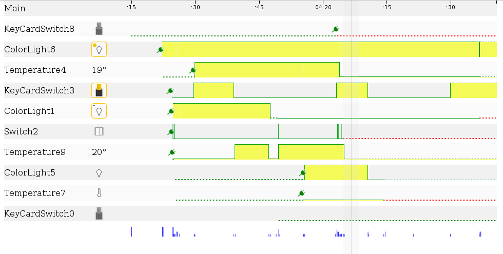

AppsGate.Debugger
=================

Debugger for AppsGate client.

Example
-------

An example of how to use AppsGate.Debugger is available [here](examples/basic/index.html).
In this example we demonstrate how to create a simple instance of a Dashboard debugger and how to integrate
AppsGate.Debugger with [requirejs]. 

To start the example you will need to install some dependencies (see section [development](#development) below).
When those dependencies are installed, just run the following:

    $ grunt serve

AppsGate.Debugger comes with a basic AppsGate server which generate data compatible with the 
AppsGate.Debugger communication protocol. This server can, among other things, be used to serve
dynamically-generated data or to replay existing data from a file. 
The list of available options can be obtained by doing the following:

    $ node server.js --help

Development
-----------

This section is devoted to people who wish to build their own AppsGate.Debugger.

### Requirements

- [nodejs]
- [grunt-cli]

While you can install [nodejs] from your package manager, or by downloading the installer, [grunt-cli] needs to
be installed manually. To do so do the following:

    $ npm install -g grunt-cli
    
You might need to execute this command as root.

### Build

Before building AppsGate.Debugger you need to retrieve all the dependencies used for the build process,
to do so do the following:
 
    $ npm install
    
Then to build AppsGate.Debugger do the following:
 
    $ grunt build

References
----------

- [nodejs]
- [grunt-cli]
- [requirejs]

[nodejs]:       http://nodejs.org/  "NodeJS"
[grunt-cli]:    https://www.npmjs.org/package/grunt-cli "Grunt-CLI"
[requirejs]:    http://www.requirejs.org/   "RequireJS"

